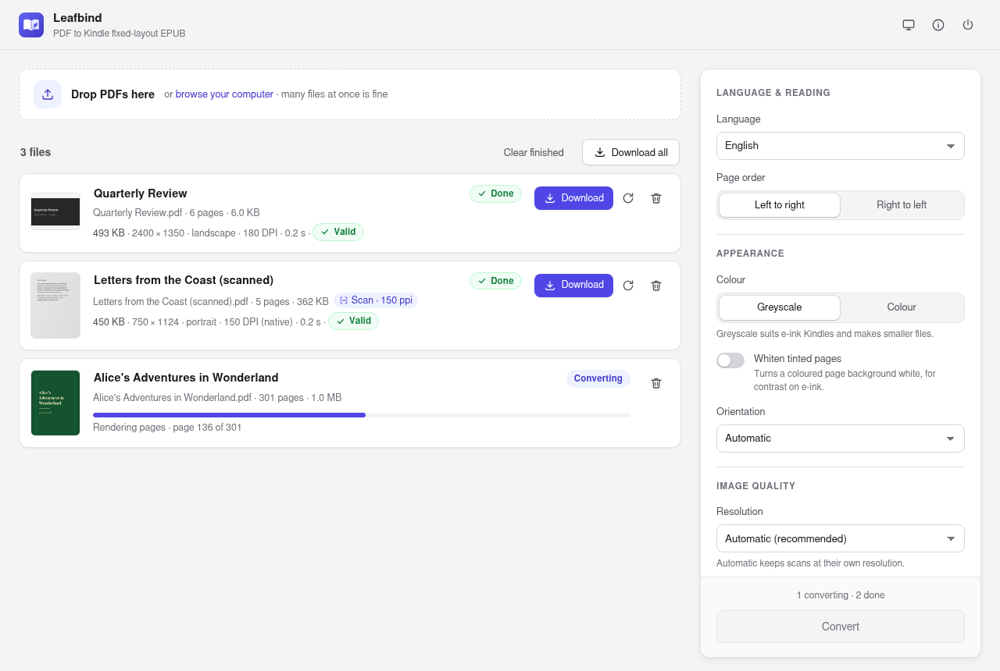
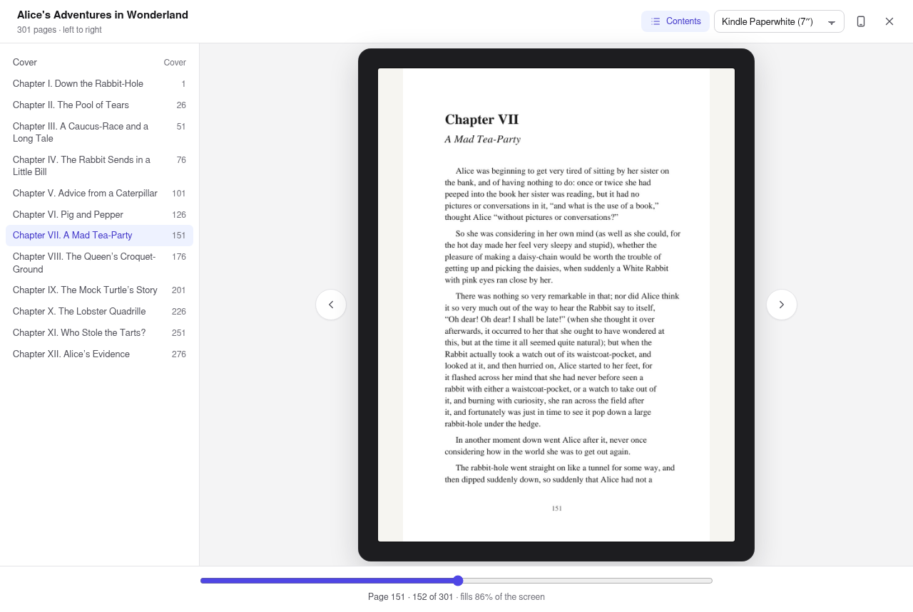

<p align="center">
  
</p>

<h1 align="center">Leafbind</h1>

<p align="center">PDF to Kindle fixed-layout EPUB, with every page kept exactly.</p>

<picture>
  <source media="(prefers-color-scheme: dark)" srcset="docs/screenshots/leafbind-dark.png">
  
</picture>

Converts a PDF into a Kindle-compatible **fixed-layout EPUB 3**. Every page
becomes an image on one shared canvas, so the original typesetting survives
exactly — right-to-left scripts, complex ligatures, tables and slide layouts
included. It is built for scanned books and slide decks, where reflowing the
text is not an option.

It is a single static executable with no runtime dependencies: no poppler, no
ImageMagick, no zip tool, no Java.

## Why this tool exists

Amazon's Kindle Previewer converts an EPUB into a Kindle book, but it does not
convert a PDF into an EPUB. A PDF has to become a fixed-layout EPUB some other
way first, and doing that well — every page kept intact, the right
orientation, no stretched or split pages, and the metadata Kindle's
fixed-layout support relies on — is fiddly. Leafbind was developed to
fill that gap: it turns the PDF into the fixed-layout EPUB that Kindle
Previewer, or Send to Kindle, can then take the rest of the way.

## Features

- **Graphical interface or command line.** Double-click it for a desktop
  app with drag and drop, cover previews and live progress; give it
  arguments and it is a scriptable command-line tool.
- **Orientation detected per book.** Landscape decks come out landscape and
  portrait books portrait, including pages that use the PDF `/Rotate` flag.
- **No stretching, no split pages.** Pages of differing sizes are scaled to fit
  one canvas and letterboxed, never distorted.
- **Resolution chosen for you.** A scanned PDF is rendered at its own
  resolution, so pages are neither upscaled nor blurred; everything else at
  180 DPI.
- **E-ink options.** 8-bit greyscale, and flattening of tinted page backgrounds
  to white for better contrast.
- **Right-to-left or left-to-right** page progression.
- **Page ranges and encrypted PDFs.** Convert only the pages you want, and
  open password-protected PDFs.
- **A real table of contents.** The PDF's bookmarks become the book's
  contents, nested as they are in the PDF, and its page labels (`iv`, `12`)
  let the Kindle go to a page by its printed number.
- **Page preview.** Flip through the finished book on a Kindle-sized screen
  before sending it, to check every page fits the way you expect.
- **Validates its own output**, and runs [epubcheck](https://github.com/w3c/epubcheck)
  as well when it is installed.
- **Compact.** A built-in JPEG encoder builds Huffman tables for each page
  from its own statistics — lossless, and typically 5–10% smaller than
  Go's standard encoder.
- **Fast.** Pages are rendered in parallel.
- **Cross-platform.** Linux, macOS and Windows, on x86-64 and ARM64.

## Install

Download the archive for your platform from the
[releases page](https://github.com/abdulwaheedsyed/leafbind/releases),
check it against `SHA256SUMS`, and put the `leafbind` binary somewhere
on your `PATH`:

```bash
sha256sum --ignore-missing -c SHA256SUMS      # macOS: shasum -a 256 -c SHA256SUMS
tar -xzf leafbind-*-linux-amd64.tar.gz
```

On macOS, a binary downloaded through a browser is quarantined by Gatekeeper
because it is not notarised. Clear the flag once after extracting:

```bash
xattr -d com.apple.quarantine leafbind
```

Or install from source with Go 1.27 or later:

```bash
go install github.com/abdulwaheedsyed/leafbind@latest
```

Or build from a clone:

```bash
make build        # ./leafbind for this machine
make dist         # every supported platform, into dist/
make package      # release archives and SHA256SUMS, into dist/
```

No C compiler is needed for any target: the build is pure Go with
`CGO_ENABLED=0`.

## The graphical interface

Double-click `leafbind`, or run it without arguments. It opens a
window where you drop in PDFs, review each book's title, and choose the
language, page order, colour and quality. Converted books are validated and
offered for download, one at a time or all together. The window follows the
system's light or dark theme. Each book can be limited to a page range, and
a password-protected PDF asks for its password, which is kept in memory only.

**Preview** opens a finished book on a Kindle-sized screen, read back from the
EPUB itself. Pages are scaled to fit the screen as a Kindle scales a
fixed-layout page, so you can see how much of the screen each one fills, and
whether a landscape page reads better with the Kindle turned sideways. Choose
the Kindle model, turn it, jump through the contents, or turn pages with the
arrow keys; a right-to-left book turns the other way. It does not replace
Kindle Previewer's rendering, but it catches a page in the wrong orientation
or a missing chapter before you send the book.

<picture>
  <source media="(prefers-color-scheme: dark)" srcset="docs/screenshots/leafbind-preview-dark.png">
  
</picture>

The interface is a small web app built into the binary. It opens in an app
window of Chrome, Edge, Chromium or Brave when one is installed, and in the
default browser otherwise. Set `LEAFBIND_BROWSER` to `default` to
always use the default browser, or to the path of a Chromium-based browser
to use that one. Closing the window, or choosing Quit, ends the program.

`--no-browser` prints the interface's address instead of opening it, which
suits a machine you reach over SSH:

```bash
leafbind --no-browser
```

The interface only listens on `127.0.0.1`, and every request must carry a
random token that is new each time it starts, so other users on the machine
and web pages open in the browser cannot reach it. PDFs you add are kept in a
temporary folder that is deleted when the program exits.

## Command line

```bash
leafbind [options] input.pdf output.epub
```

Options may appear anywhere on the command line, as `--name value`,
`--name=value` or `-name value`.

| Option | Default | Meaning |
| --- | --- | --- |
| `--dpi N\|auto` | `auto` | Render resolution. `auto` uses a scan's own resolution, otherwise 180. See [Choosing a DPI](#choosing-a-dpi). |
| `--max-edge N` | `2560` | Cap on the longest canvas edge in pixels; `0` disables the cap. |
| `--quality N` | `92` | JPEG quality, 1–100. |
| `--grayscale` | off | 8-bit greyscale for e-ink. Aliases: `--greyscale`, `--mono`. |
| `--flatten-bg` | off | Force a flat, tinted page background to white. Aliases: `--white-bg`, `--flatten-background`. |
| `--title TEXT` | file name | Book title. |
| `--lang CODE` | `en` | BCP 47 language tag, such as `en`, `ar`, `ur` or `ur-Latn`. |
| `--rtl` | LTR | Right-to-left page progression, for Arabic, Urdu, Hebrew and similar. `--ltr` selects the default explicitly. |
| `--orientation X` | detected | Force `portrait`, `landscape`, `auto` or `none`. |
| `--mixed` | off | Keep each page's own canvas instead of one shared canvas. |
| `--pages RANGE` | all | Convert only these pages, such as `1-20,25,30-`; numbers are the PDF's page positions, from 1. The book keeps the PDF's page order. |
| `--password TEXT` | | Password of an encrypted PDF. `LEAFBIND_PASSWORD` in the environment works too, and keeps it out of the process list. |
| `--toc X` | `bookmarks` | Table of contents: `bookmarks`, from the PDF's outline when it has one, otherwise one entry per page; or `pages`, always one entry per page. |
| `--jobs N` | CPUs, max 6 | Pages rendered in parallel. |
| `--no-validate` | off | Skip all validation. |
| `--no-epubcheck` | off | Skip the external epubcheck even when it is installed. |
| `--check` | | Validate the EPUBs given instead of converting; see [Validation](#validation). |
| `-v`, `--verbose` | off | Print one line per page. |
| `--gui` | | Open the graphical interface; the same as giving no arguments. |
| `--no-browser` | | With the interface, print its address instead of opening it. |
| `--version` | | Print the version. |
| `--licenses` | | Print the license and third-party notices. |

Exit status is `0` on success, `1` when conversion or validation fails, and
`2` for a usage error.

## Examples

A book in greyscale for e-ink:

```bash
leafbind --grayscale --title "Book Title" book.pdf book.epub
```

A right-to-left book, such as Arabic or Urdu:

```bash
leafbind --grayscale --rtl --lang ar --title "Book Title" book.pdf book.epub
```

Part of a PDF, skipping the front matter and the index:

```bash
leafbind --pages 9-240 book.pdf book.epub
```

A password-protected PDF:

```bash
LEAFBIND_PASSWORD='the password' leafbind book.pdf book.epub
```

A book printed on a tinted background:

```bash
leafbind --grayscale --flatten-bg book.pdf book.epub
```

A book whose small print should stay sharp when zoomed:

```bash
leafbind --grayscale --dpi 300 book.pdf book.epub
```

A smaller file, at some cost in sharpness:

```bash
leafbind --grayscale --dpi 150 --quality 85 --max-edge 1920 book.pdf book.epub
```

Every PDF in a directory (POSIX shell):

```bash
for f in *.pdf; do leafbind --grayscale "$f" "${f%.pdf}.epub"; done
```

The same in PowerShell:

```powershell
Get-ChildItem *.pdf | ForEach-Object { leafbind --grayscale $_.FullName ($_.BaseName + ".epub") }
```

## Choosing a DPI

The default, `auto`, looks at the PDF first. Nine pages spread through it
are sampled: when every one is a single image covering the page, with no
text, the PDF is a scan, and it is rendered at the median resolution of
those images. Rendering a scan any higher only interpolates — a larger file
with no more detail — and any lower throws detail away. Covers are often
scanned finer than the body, which is why the median is used. Every other
PDF is rendered at 180 DPI, which suits vector text on a Kindle screen.

The GUI shows a "Scan" badge with the detected resolution when you add a
file, and the command line reports it:

```text
Resolution  : 150 DPI (scan, native resolution)
```

Pass a number to override it, for instance `--dpi 300` for small vector text
that should stay crisp when zoomed.

## How it works

1. **Choose a resolution.** With `--dpi auto`, sample the pages to decide
   whether the PDF is a scan, as described above.
2. **Measure.** Each page's pixel size at that resolution is taken from the PDF
   engine, including any `/Rotate`, so a rotated page is never mistaken for the
   wrong orientation.
3. **Pick a canvas.** The canvas starts from the most common page size, grows
   if needed to contain the largest page at that same aspect ratio, is capped
   at `--max-edge`, and is rounded down to even dimensions.
4. **Render and fit.** Pages are rendered in parallel, scaled to fit inside
   the canvas with their aspect ratio intact, and padded out to its exact size.
   Nothing is cropped or stretched. The padding colour is sampled from the edge
   being padded, so letterbox bars blend with the page.
5. **Convert.** Optionally greyscale and background flattening.
6. **Encode.** Each page is written as a baseline JPEG with Huffman tables
   optimised for that page.
7. **Package.** Standard EPUB 3 fixed-layout metadata, plus Kindle's own
   fixed-layout metadata. Page 1 becomes the cover. The table of contents
   comes from the PDF's bookmarks, with their nesting; a bookmark that
   leaves the document is left out, and one that only groups others opens
   its first child's page. A page list, labelled with the PDF's page labels
   where it has them, lets a reader go to a page by number.
8. **Validate** the package that was written.

### Why one canvas

Kindle uses a single canvas per book. When pages declare viewports with
differing aspect ratios, the ones that do not match are distorted to fit.
Normalising every page onto one canvas prevents that. `--mixed` keeps
per-page canvases for a book that genuinely mixes portrait and landscape
pages, but Kindle handles such books poorly; splitting the PDF into separate
books usually gives a better result.

### Greyscale

E-ink Kindles display about 16 levels of grey, so colour only adds bytes there.
The conversion is Rec. 709 luma on the gamma-encoded values, which preserves
perceived lightness. Converting in linear light instead drags mid tones much
darker, which costs legibility on a low-contrast panel.

Colour Kindles and the Kindle apps do display colour, and greyscale is lossy
for them. Keep the source PDFs.

### Background flattening

A tint across most of the page costs contrast an e-ink panel cannot spare.
`--flatten-bg` detects each page's dominant colour and whitens it only when it
covers at least a quarter of the page and is light enough to be a background.
In greyscale this is a white point, which leaves every darker tone unchanged,
so text is not touched. In colour it matches the background colour itself, so
the hue of a tint is never shifted. Dark themes are left alone, since removing
that background would mean inverting the page.

## Validation

Every conversion is validated before the program reports success, in two
layers.

**Built-in EPUB validation.** Leafbind includes its own implementation of the
checks [EPUBCheck](https://github.com/w3c/epubcheck), the W3C's reference
validator, applies to books like the ones it makes, and it reports EPUBCheck's
own message codes, severities and texts: `RSC-005`, `OPF-030`, `HTM-046` and
the rest. It covers the OCF container, package documents (metadata, manifest,
spine, prefixes, fixed-layout properties, several renditions), content and
navigation documents (well-formedness, HTML content models, references,
viewports, declared features), CSS syntax and images. It needs no Java.

HTML content models, which elements and attributes may appear where, are
checked against EPUBCheck's own XHTML schema, embedded unchanged and run by
a RELAX NG validator written in Go for Leafbind (`internal/rng`). The rules
the schema cannot express, such as no links inside links and ID references
that must resolve, follow EPUBCheck's Schematron rules.

It is tested against EPUBCheck 5.4.0 itself: a corpus of 86 books, one valid
and each of the others broken in one particular way, with EPUBCheck's
findings for every one recorded, and the built-in checks must agree with
all of them. CI re-runs EPUBCheck on the corpus so the recording cannot
drift. On the 45 books of the W3C's
[EPUB 3 samples](https://github.com/IDPF/epub3-samples) the built-in checks
agree with EPUBCheck on every book, and report nothing EPUBCheck does not.
What is not covered yet is listed in [TODO.md](TODO.md).

Validate any EPUB, not only Leafbind's, with `--check`:

```bash
leafbind --check book.epub
```

```text
book.epub: ERROR(OPF-049): OEBPS/content.opf(22,5): Item id "page-003" was not found in the manifest.
book.epub: ERROR(RSC-005): OEBPS/content.opf(22,5): Error while parsing file: itemref idref "page-003" does not resolve to a manifest item
book.epub: ERROR(RSC-011): OEBPS/nav.xhtml(10,5): Found a reference to a resource that is not a spine item.
book.epub: Messages: 0 fatals / 3 errors / 0 warnings
```

**Leafbind's own rules** have codes starting `LB-`. Some are stricter than
EPUBCheck, where a less forgiving reading system could trip: a compressed
`mimetype` file, which the container specification forbids, whitespace around
`rendition:*` values, and files in the archive that the manifest does not
list. The rest compare the book with the PDF it came from: one page per PDF
page, and every page image matching its viewport, the canvas and, with
`--grayscale`, greyscale.

When `epubcheck` itself is on `PATH` it runs as well, as a second opinion.

A book with errors is still written, so it can be inspected, but the program
exits with status `1`. Warnings are reported without failing the book, as
EPUBCheck does. The report groups problems by code, since one fault usually
repeats on every page.

## Supported platforms

| OS | Architectures |
| --- | --- |
| Linux | amd64, arm64 |
| macOS | amd64, arm64 |
| Windows | amd64, arm64 |

These are the architectures where the embedded WebAssembly runtime compiles to
native code. On others it falls back to an interpreter and becomes far too slow
to be useful.

## Dependencies

There is no PDF rasteriser in Go's standard library, so rendering uses
[go-pdfium](https://github.com/klippa-app/go-pdfium): Google's PDFium, compiled
to WebAssembly and run inside the process by
[wazero](https://github.com/tetratelabs/wazero), a pure-Go WebAssembly
runtime. This is what keeps the binary free of cgo and system libraries. The
graphical interface uses an installed web browser to draw its window; see
[TODO.md](TODO.md) for the plan to replace that, and the other remaining
external tools, with built-in equivalents.

The PDF engine runs sandboxed with no filesystem access; the PDF is passed to
it in memory. JPEG encoding is the program's own. Everything else — colour
conversion, ZIP packaging, XML and validation — is Go's standard library, plus
[golang.org/x/image](https://pkg.go.dev/golang.org/x/image) for resampling.

## Development

```bash
make test         # all tests, including end-to-end conversions (about 20 s)
make test-short   # unit tests only; skips anything that starts the PDF engine
make notices      # regenerate THIRD_PARTY_NOTICES.md after changing dependencies
go run ./tools/demodocs -o demo   # the sample PDFs shown in the screenshots
```

CI runs the full test suite on every released platform for each push to
`main` and each pull request. Pushing a tag such as `v1.2.3` builds, tests
and publishes a release with the archives attached.

The tests fail if a linked module is missing from `THIRD_PARTY_NOTICES.md` or
listed at the wrong version, so the notices cannot silently go stale.

The end-to-end tests generate their own PDFs, so no sample documents are
needed. They cover landscape and portrait detection, `/Rotate`, pages of
differing sizes, `--mixed`, greyscale with background flattening, scan
detection, and invalid input. The GUI server is tested for its security
checks and for a whole add, convert and download round trip. The validator is tested against deliberately broken packages. The
JPEG encoder is tested for lossless optimisation, valid length-limited code
tables, minimal padding blocks, and quality against `image/jpeg`.

## Notes

- **Package values are written on one line.** EPUB 3.3 asks reading systems
  to trim whitespace around a value such as `rendition:layout`, and EPUBCheck
  accepts `pre-paginated` written across several lines. A reading system that
  compares the raw text instead would miss it and fall back to a reflowable
  layout, so Leafbind writes every value on one line, and `LB-003` flags any
  that is not.
- **Output is written atomically.** The EPUB is written to a temporary file
  beside the destination and renamed into place, so an interrupted run never
  leaves a half-written book or destroys an existing one.
- **JPEG encoding.** Go's `image/jpeg` always uses the example Huffman tables
  from the JPEG specification. This program's encoder instead gathers each
  page's symbol statistics and builds length-limited optimal tables, the
  procedure of Annex K.2 of the specification and what libjpeg's
  `optimize_coding` does. Output is baseline JPEG for the widest reader
  support: one component for greyscale, YCbCr with 4:2:0 subsampling for
  colour. The optimisation is lossless — the tests check that decoded pixels
  are identical to an encoding with the standard tables — and `jpegtran
  -optimize` finds nothing further to remove.

## License

Leafbind is released under the [MIT License](LICENSE).

Its executables include third-party software under their own licenses — Go,
the Go modules it uses, and PDFium with the libraries compiled into its
WebAssembly build. [THIRD_PARTY_NOTICES.md](THIRD_PARTY_NOTICES.md) lists them
with their full license texts. The same text is embedded in every binary and
printed by `leafbind --licenses`, and `make dist` places both files
beside the binaries it builds.

This software is based in part on the work of the FreeType Team.

This software is based in part on the work of the Independent JPEG Group.
